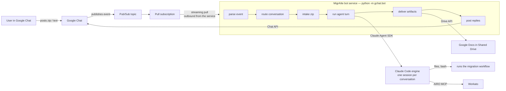

# MigrAIte — How the Google Chat Bot Works (internal)

How Google Chat, Pub/Sub, the bot service and the Claude Agent SDK were put
around the migration workflow. This doc is about plumbing: how a message
gets in, how the agent is invoked, how its answers get back out, and how
artifacts and state are handled. The workflow the agent runs is in
[migraite-workflow.md](migraite-workflow.md).

Related: [setup](migraite-bot-setup.md) · [client onboarding](migraite-client-onboarding.md) · [user guide](migraite-user-guide.md)

---

## 1. In one page



Nothing calls the service. It pulls events from Google, pushes replies to
Google. That is why it can run on a laptop today and on a server tomorrow
with no networking change.

Today the service is a foreground process on a developer machine with a
single identity. Sections marked *(target)* describe the hosted, multi-client
design that is agreed but not yet built.

---

## 2. Components

| Component | File | Responsibility |
|---|---|---|
| Bot process | `gchat/bot.py` | Pub/Sub pull loop, event parsing, conversation routing and state, commands, artifact delivery, edit sync |
| Chat client | `gchat/chat_api.py` | Post messages (chunked to the 4096-char limit), download attachments; rebuilds its HTTP client on stale-socket errors |
| Drive client | `gchat/drive_api.py` | Upload markdown as Google Docs into a per-run folder; export Docs back to markdown; edit detection |
| Intake | `gchat/intake.py` | Zip → `WebMethods/<PackageName>/` (both zip shapes, zip-slip guarded) |
| Agent session | `gchat/session.py` | One Claude Agent SDK client per conversation; event stream; budget/timeout guards; cumulative cost |
| Prompts | `gchat/prompts.py` | Kickoff prompt and per-turn re-anchor header (see the workflow doc) |
| Env | `gchat/env.py` | `.env` loading and typed getters |
| CLI harness | `gchat/cli_harness.py` | Same session loop over stdin/stdout — development without Google |

Runtime state: `gchat/state.json` (gitignored) — per conversation: agent
session id, package, state, delivered Doc ids and their edit baselines,
requester. A restart resumes conversations from it.

---

## 3. Inbound: how a message reaches the service

1. A user posts in a **DM** with the app, or **@mentions** it in a space
   (in spaces, un-mentioned messages are not delivered to apps).
2. Google Chat publishes an event to the **Pub/Sub topic** named in the Chat
   app's configuration. For that to work, Google's per-app service agent
   (shown on the Chat Configuration page as the "service account email",
   `service-<projectnumber>@gcp-sa-gsuiteaddons.iam.gserviceaccount.com`)
   must hold **Pub/Sub Publisher** on the topic. Granting the legacy
   `chat-api-push@system.gserviceaccount.com` instead fails with
   `PERMISSION_DENIED` — visible only in Cloud Logging if the app has error
   logging on.
3. The service holds a **streaming pull** on the subscription
   (`google-cloud-pubsub` `SubscriberClient.subscribe`). Events arrive on a
   gRPC thread; the callback **acks immediately** and hands the event to the
   asyncio loop (`loop.call_soon_threadsafe`). Processing can take minutes;
   holding the ack would cause redelivery. A small LRU of message names drops
   the duplicates Pub/Sub occasionally delivers anyway.

**Event shape.** Current-generation Chat apps run on the Workspace Add-ons
infrastructure and deliver
`{"chat": {"user": …, "messagePayload": {"message": …, "space": …}}}`; the
classic `{"type": "MESSAGE", "message": …, "space": …}` shape is also
accepted. `Bot._parse_event` normalizes both to `{msg, space, sender,
is_dm}`. Non-message events (added to space, app commands) are ignored.

**Properties of pull that matter operationally.**
- **Exactly one bot process per subscription.** Two subscribers are
  load-balanced by Pub/Sub — each receives roughly half the messages, and
  since each keeps its own conversation state, a conversation splits across
  both. The symptom is "it answers every other message."
- If the service is down, messages queue in the subscription (7-day
  retention) and are processed on start. Messages published before the
  subscription existed are not retained.
- Google shows a transient **"app isn't responding"** banner because pull
  apps never reply synchronously; it clears when the reply lands. Only an
  HTTPS-endpoint transport removes it — a hosting-time change that touches
  the transport module only.
- A network outage kills the streaming connection; the client library
  reconnects on its own once the network returns (observed), but any agent
  session started during the outage has lost its MCP servers (§5).

---

## 4. Conversations, routing and state

| Where | Conversation key | Replies |
|---|---|---|
| DM with the app | the space | flat (unthreaded) |
| Space | the thread | threaded — one thread = one migration |

Each conversation is a small state machine:

```
IDLE ──zip──▶ AGENT_RUNNING ──turn ends──▶ WAITING_FOR_USER ──reply──▶ AGENT_RUNNING …
                    │
                    └── cost/turn limit ──▶ BUDGET_PAUSED ──/continue──▶ …
/abort (any state) ──▶ DONE        /new (any state) ──▶ IDLE (fresh conversation)
```

- A **zip attachment** in an IDLE conversation starts a migration; text sent
  with it becomes the user's initial instructions. The attachment is
  downloaded through the Chat media API with the app's credentials.
- While AGENT_RUNNING, a user message gets an immediate "⏳ still working"
  acknowledgment and the latest one is buffered for delivery when the turn
  ends, so an early "approved" is not lost. `/abort` cancels the running
  turn.
- An optional **allowlist** (`GCHAT_ALLOWED_USERS`) restricts who can talk to
  the bot; bot-authored messages are ignored.
- **One migration at a time** across the service today, because the
  workflow writes fixed paths in one working directory.

*(target)* Routing also resolves **which client** a conversation belongs to
(by space id, falling back to sender domain) and loads that client's
registry entry — working directory, Claude config directory, Drive folder,
default Workato folder, cost cap (§5.1).

---

## 5. The agent turn: how the SDK is invoked

Each conversation owns a `ClaudeSDKClient` (Claude Agent SDK, Python). It
spawns the Claude Code engine as a subprocess and keeps it alive across
turns, so the conversation has full context without re-sending history.

Options that matter:

| Option | Value | Why |
|---|---|---|
| `cwd` | the repository checkout | the engine loads `CLAUDE.md`, skills and instruction docs — the same brain as an interactive session |
| `setting_sources` | `["project"]` | required; without it no project context loads and quality silently degrades |
| `permission_mode` | `bypassPermissions` | unattended; the workflow's human approval gate is the real control |
| `mcp_servers` | Workato AIRO (`https://app.workato.com/airo_mcp`, HTTP) | the recipe-builder tools |
| `resume` | saved session id | continue a conversation after a service restart |
| `env` | *(target)* `CLAUDE_CONFIG_DIR=<client dir>` | selects which AIRO login the session carries |

**MCP auth.** AIRO accepts only OAuth tokens obtained through an interactive
login by a real Workato user (it rejects Workato REST API tokens and refuses
machine-to-machine grants). The engine stores that token in its Claude
config directory and reuses it headlessly. **MCP servers connect once at
session start**; if AIRO is unreachable then, the session never gets it — a
new session (restart + resume, or `/new`) is required.

**Turn protocol.** A user message becomes one `query()`; the service
iterates `receive_response()` until the result message. During the turn:
- the agent's **final message of the turn is posted to the user** — its
  summary, its question, or its build result. Mechanically: text the agent
  writes *after its last tool call* is the final message; text it writes
  *between* tool calls ("Loading the mapping reference…", "Now the foreach
  loop…") is working narration and goes to the service log only;
- every `GCHAT_HEARTBEAT_S` seconds (default 180) a "⏳ Still working…" is
  posted so long turns are visibly alive;
- the result's cumulative `total_cost_usd` becomes a footer
  `(turn: $x · total: $y)` on the final message;
- state is saved after every turn.

**Guards** (env-tunable): `GCHAT_MAX_COST_USD` per conversation,
`GCHAT_MAX_TURNS`, `GCHAT_TURN_TIMEOUT_S` (set ≥ 3600 — builds take 20–30
min). Breaching cost/turns pauses until `/continue` (one more allotment) or
`/abort`; a timeout interrupts the engine and asks for a message to continue.

**Identity today.** The engine authenticates with `ANTHROPIC_API_KEY` if
set, otherwise with the Claude login stored in the config directory it runs
with — which, on the developer machine, is the developer's personal login.
For a service, set the API key.

### 5.1 Per-client identity *(target)*

A **client registry** (config file, later a table) maps each client to:

```
acme:
  chat_spaces: [spaces/…]              # or sender_domain: acme.com
  claude_config_dir: /srv/migraite/clients/acme/claude   # holds acme's AIRO OAuth token
  workato_default_folder_id: 123456
  drive_folder_id: 0A…                 # their folder in the Shared Drive
  max_cost_usd: 25
  workdir: /srv/migraite/clients/acme/repo               # own checkout
```

The service creates the session with `CLAUDE_CONFIG_DIR=<claude_config_dir>`
and `cwd=<workdir>`. The Claude identity (`ANTHROPIC_API_KEY`) is shared;
only the Workato login differs. Verified: the engine honors the `env` option
and MCP auth state is per config directory (an empty directory has no AIRO
access). The SDK also accepts per-session HTTP `headers`, which would have
been simpler, but AIRO issues no non-interactive tokens to put in them.
Per-client `workdir` also removes the one-migration-at-a-time limit across
clients.

---

## 6. Outbound: how replies get back to Chat

The service posts with the service account and the `chat.bot` scope
(`spaces.messages.create`), which only works in spaces the app is a member
of. Text over ~3800 characters is split on paragraph boundaries. Threaded
replies use `REPLY_MESSAGE_FALLBACK_TO_NEW_THREAD`; DM replies are unthreaded
(the reply option is invalid without a thread).

Posting happens directly from the service — there is no outbound queue.
Transient failures (stale keep-alive sockets after idle) are handled by
rebuilding the client and retrying once.

Chat apps **cannot upload file attachments** — Google restricts that API to
user authentication — which is why artifacts go through Drive.

---

## 7. Artifacts: Google Docs delivery and edit sync

After any turn that changed an analysis file:

1. The service creates (once per run) a subfolder in the Shared Drive:
   `<Package> — <YYYY-MM-DD HH:MM> — <requester>`.
2. Uploads each changed markdown file **converted to a Google Doc**;
   revisions update the same Doc, so Docs version history shows each round.
3. Records the Doc's export fingerprint as the baseline.
4. Posts the links.

On the user's next non-command reply, each Doc is exported as markdown
(`files.export`, `text/markdown`) and its fingerprint compared with the
baseline. Google's converter noise is identical on both sides and cancels;
only a real edit registers. A changed Doc is written to disk (converter
escapes stripped, table rules normalized), the user sees "📝 Picked up your
edits", and the agent is told those files are user-edited and
authoritative.

Limits: fenced code blocks and ASCII diagrams do not survive Docs
conversion; Doc *comments* (as opposed to text) are not picked up. The
on-disk markdown remains the artifact of record.

Why a Shared Drive: service accounts have **no Drive storage quota**; a file
they create in a My Drive folder fails with `storageQuotaExceeded`. In a
Shared Drive, files belong to the organization.

---

## 8. Known limits and the path to a hosted service

| Limit | Why | Path |
|---|---|---|
| One process per subscription | Pub/Sub load-balances subscribers | Inherent — run exactly one |
| One migration at a time | Fixed analysis paths in one checkout | Per-client `workdir` |
| Single Workato identity | One AIRO login today | Per-client config directory (§5.1) |
| Single Drive destination | One Shared Drive id today | Registry `drive_folder_id` |
| "Isn't responding" banner | Pull transport has no synchronous reply | HTTPS endpoint transport when hosted |
| Failed MCP never retried in-session | Engine behavior | Restart + resume, or `/new` |
| Dies with its terminal | Foreground process today | systemd / launchd service |

Hosting changes none of the code paths above; it moves the process, sets the
API key, and adds the registry.

---

## 9. Operational notes

- **Logs**: every received message, agent tool calls, agent text
  (truncated), delivery/sync events, full tracebacks. Nothing sensitive.
- **Commands**: `/new` (reset conversation), `/abort` (stop now, mid-turn
  included), `/continue` (extend budget after a pause).
- **Development loop**: `python -m gchat.cli_harness --package <Pkg>` runs
  the identical agent loop over stdin/stdout without Google.
